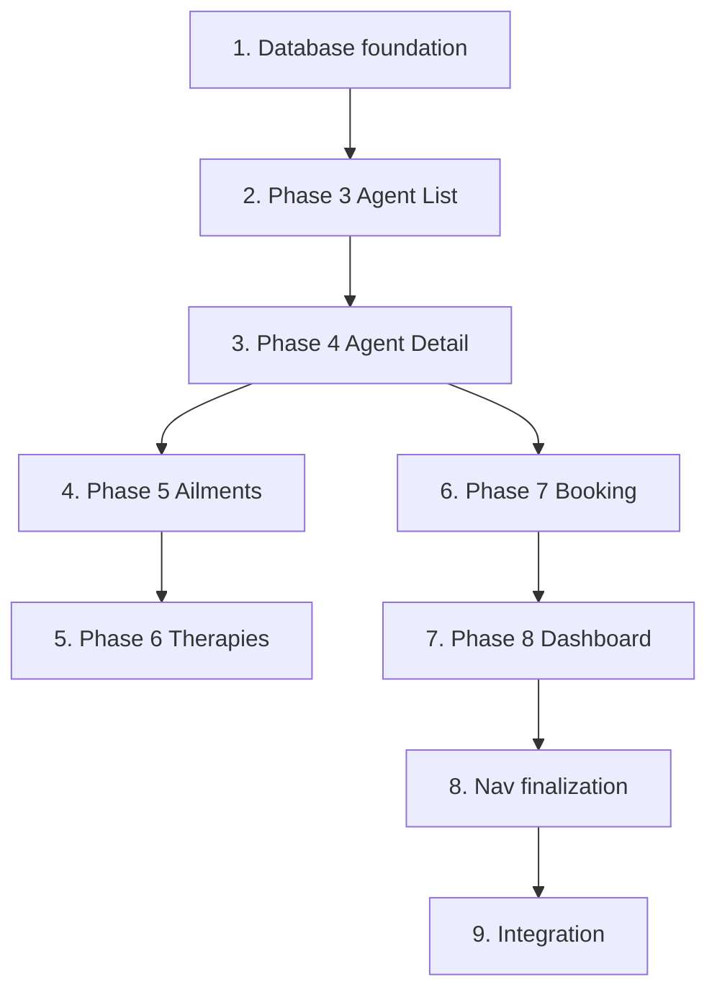

# Plan — MVP (Phases 3–8)

Numbered task groups in **roadmap order** (Phase 3 → 8). Each phase is fully implemented before the next begins. All work lands on branch **`feature/mvp`** for a single merge to `master`.

## 0. Branch and spec setup

1. Confirm on branch `feature/mvp` (created from `master`).
2. Spec files in `specs/2026-06-30-mvp/` (`requirements.md`, `plan.md`, `validation.md`).

## 1. Database foundation (supports Phases 3–8)

1. Add `better-sqlite3` and types as dependencies.
2. Create `src/db/` module:
   - `connection.ts` — open SQLite database (path from env or default `data/agentclinic.db`)
   - `migrate.ts` — run SQL files in order
   - `seed.ts` — insert demo-ready seed data
3. Add **`migrations/001_init.sql`** — single init migration creating:
   - `agents` (id, name, model_type, status, presenting_complaints, …)
   - `ailments` (id, name, description, …)
   - `therapies` (id, name, description, …)
   - `agent_ailments` (agent_id, ailment_id)
   - `ailment_therapies` (ailment_id, therapy_id)
   - `appointments` (id, agent_id, scheduled_at, status, …)
4. Add **`seeds/demo.sql`** (or TypeScript seed script) — 8–10 agents, 10+ ailments, 10+ therapies, junction rows, sample appointments.
5. Wire migration + seed into app startup (or `npm run db:setup` script).
6. Light Vitest test: migration runs, tables exist, seed row counts meet minimums.

## 2. Phase 3 — Agent List

1. Create `src/repositories/agents.ts` — query all agents.
2. Create `src/pages/AgentsList.tsx` — Pico-styled responsive table/list.
3. Replace `AgentsComingSoon.tsx` usage — **GET `/agents`** renders real list.
4. Update `Nav.tsx` — add Ailments, Therapies, Dashboard links (stubs or real routes as phases land).
5. Pass `currentPath` from each route through `Layout`.
6. Vitest: `src/routes/agents.route.test.ts` — 200, agent names from seed, layout shell.

## 3. Phase 4 — Agent Detail

1. Extend `src/repositories/agents.ts` — `getAgentById`, `getAilmentsForAgent`.
2. Create `src/pages/AgentDetail.tsx` — name, model type, status, presenting complaints, linked ailments.
3. Register **GET `/agents/:id`** in `src/app.ts`.
4. List page rows link to `/agents/:id`.
5. Handle unknown id (minimal — plain error response until Phase 10).
6. Vitest: `src/routes/agent-detail.route.test.ts` — 200 + fields for valid id; error for missing id.

## 4. Phase 5 — Ailments Catalog

1. Create `src/repositories/ailments.ts` — list ailments, agents per ailment.
2. Create `src/pages/AilmentsList.tsx`.
3. Register **GET `/ailments`**.
4. Show linked agents on ailments list (or count column).
5. Vitest: `src/routes/ailments.route.test.ts` — 200, seeded ailment names present.

## 5. Phase 6 — Therapies Catalog

1. Create `src/repositories/therapies.ts` — list therapies with related ailments.
2. Create `src/pages/TherapiesList.tsx`.
3. Register **GET `/therapies`**.
4. Vitest: `src/routes/therapies.route.test.ts` — 200, seeded therapy names present.

## 6. Phase 7 — Appointment Booking

1. Create `src/repositories/appointments.ts` — create appointment, list by agent.
2. Add booking **form** to `AgentDetail.tsx` — datetime input, submit to POST.
3. Register **POST `/agents/:id/book`** (or equivalent) with validation.
4. Create `src/pages/BookingConfirmation.tsx` — show agent, datetime, status `pending`.
5. Register confirmation route (e.g. **GET `/appointments/:id/confirmation`**).
6. **Comprehensive Vitest**:
   - Form markup on detail page
   - POST success creates DB row with `pending`
   - POST rejects missing/invalid datetime
   - Confirmation page shows booking details

## 7. Phase 8 — Staff Dashboard

1. Create `src/repositories/dashboard.ts` — aggregate counts and list queries.
2. Create `src/pages/Dashboard.tsx`:
   - Summary cards: agent count, open appointments (`pending`), agents with ailments
   - Simple read-only tables: recent appointments, agents, ailments overview
3. Register **GET `/dashboard`**.
4. **Comprehensive Vitest**:
   - Counts match seeded data
   - Tables render expected rows
   - Layout + nav (Dashboard link active)

## 8. Navigation finalization

1. Ensure `Nav.tsx` lists all five links with correct hrefs.
2. Remove or repurpose `AgentsComingSoon.tsx` if unused.
3. Update `nav.test.tsx` for new links.
4. Confirm exact-match `aria-current` on each top-level route.

## 9. Integration and merge prep

1. Run `npm run typecheck` — must pass.
2. Run `npm test` — must pass (critical-path coverage per `validation.md`).
3. Manual spot-check every route at mobile and desktop widths (see `validation.md`).
4. Update `CHANGELOG.md` with MVP feature summary.
5. Single PR: `feature/mvp` → `master`.

## Dependency graph

