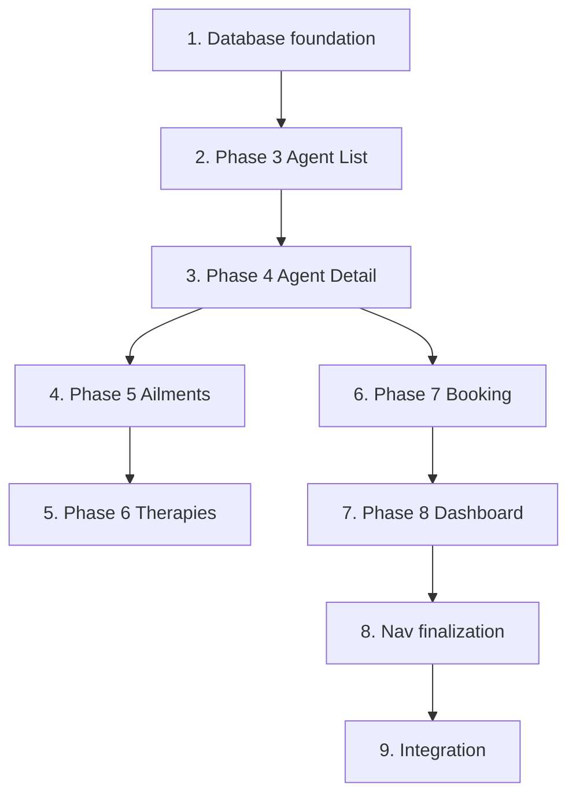

# Plan — MVP (Phases 3–8)

Numbered task groups in **roadmap order** (Phase 3 → 8). Each phase is fully implemented before the next begins. All work lands on branch **`feature/mvp`** for a single merge to `master`.

## 0. Branch and spec setup

1. Confirm on branch `feature/mvp` (created from `master`).
2. Spec files in `specs/2026-06-30-mvp/` (`requirements.md`, `plan.md`, `validation.md`).

## 1. Database foundation (supports Phases 3–8)

1. Add `better-sqlite3` and `@types/better-sqlite3` as dependencies.
2. Create `src/db/` module:
   - `connection.ts` — open SQLite; lazy migrate + seed on first `getDb()`
   - `migrate.ts` — run `migrations/001_init.sql` with `schema_migrations` tracking
   - `seed.ts` — TypeScript seed data + exported `SEED_*` count constants
   - `index.ts` — `initDb()`, `resetDb()`, re-exports
3. Add **`migrations/001_init.sql`** — full schema per **Appendix A** in `requirements.md`.
4. Seed in **`src/db/seed.ts`** (not a separate SQL file) — counts and stable names per **Appendix B**.
5. Add **`npm run db:setup`** → `tsx src/scripts/db-setup.ts` for explicit migrate + seed.
6. Add `data/` to `.gitignore`; default path `data/agentclinic.db`, override via `DATABASE_PATH`.
7. Wire lazy init: first repository call triggers migrate + seed; `src/index.ts` calls `initDb()` on server start.
8. Test infrastructure:
   - `vitest.setup.ts` — set `DATABASE_PATH=:memory:`
   - `src/test/db.ts` — `setupTestDb()` for per-test reset
9. Light Vitest: `src/db/db.test.ts` — tables exist, `SEED_*` counts match.

## 2. Phase 3 — Agent List

1. Create `src/repositories/agents.ts` — `listAgents()`.
2. Create `src/pages/AgentsList.tsx` — Pico table; name links to `/agents/:id`.
3. Replace `AgentsComingSoon.tsx` — **GET `/agents`** renders real list.
4. Update `Nav.tsx` — all five MVP nav links.
5. Vitest: `src/routes/agents.route.test.ts`.

## 3. Phase 4 — Agent Detail

1. Extend `src/repositories/agents.ts` — `getAgentById`, `getAilmentsForAgent`.
2. Create `src/pages/AgentDetail.tsx` — profile fields + ailments linking to `/ailments`.
3. Register **GET `/agents/:id`** — 404 plain text for invalid/unknown id.
4. Vitest: `src/routes/agent-detail.route.test.ts`.

## 4. Phase 5 — Ailments Catalog

1. Create `src/repositories/ailments.ts` — `listAilments()` with `agent_count`.
2. Create `src/pages/AilmentsList.tsx`.
3. Register **GET `/ailments`**.
4. Vitest: `src/routes/ailments.route.test.ts`.

## 5. Phase 6 — Therapies Catalog

1. Create `src/repositories/therapies.ts` — `listTherapies()` with ailment names.
2. Create `src/pages/TherapiesList.tsx`.
3. Register **GET `/therapies`**.
4. Vitest: `src/routes/therapies.route.test.ts`.

## 6. Phase 7 — Appointment Booking

1. Create `src/repositories/appointments.ts` — `createAppointment`, `getAppointmentWithAgent`.
2. Create `src/lib/datetime.ts` — parse + format `scheduled_at`.
3. Add booking form to `AgentDetail.tsx` — POST to `/agents/:id/book`.
4. Register routes per **Appendix C** in `requirements.md`:
   - **POST `/agents/:id/book`** — 303 redirect on success; 400 re-render on validation error
   - **GET `/appointments/:id/confirmation`**
5. Create `src/pages/BookingConfirmation.tsx`.
6. Comprehensive Vitest: `src/routes/booking.route.test.ts`.

## 7. Phase 8 — Staff Dashboard

1. Create `src/repositories/dashboard.ts` — stats + list queries.
2. Create `src/pages/Dashboard.tsx` per **Appendix E** in `requirements.md`.
3. Register **GET `/dashboard`**.
4. Comprehensive Vitest: `src/routes/dashboard.route.test.ts`.

## 8. Navigation finalization

1. Confirm all five nav links and exact-match `aria-current`.
2. Remove `AgentsComingSoon.tsx`.
3. Update `nav.test.tsx` — all links; no active state on `/agents/:id`.

## 9. Integration and merge prep

1. Run `npm run typecheck` and `npm test`.
2. Manual spot-check per `validation.md`.
3. Update `CHANGELOG.md` and mark Phases 3–8 complete on `specs/roadmap.md`.
4. Amend `requirements.md` with post-build decisions (appendices).
5. Single PR: `feature/mvp` → `master`.

## Dependency graph

## File map (implemented)

| Path | Purpose |
|------|---------|
| `migrations/001_init.sql` | Schema |
| `src/db/` | Connection, migrate, seed |
| `src/repositories/` | agents, ailments, therapies, appointments, dashboard |
| `src/pages/` | AgentsList, AgentDetail, AilmentsList, TherapiesList, Dashboard, BookingConfirmation |
| `src/lib/datetime.ts` | Datetime parse/format |
| `src/test/db.ts` | Test DB reset helper |
| `vitest.setup.ts` | In-memory `DATABASE_PATH` |
